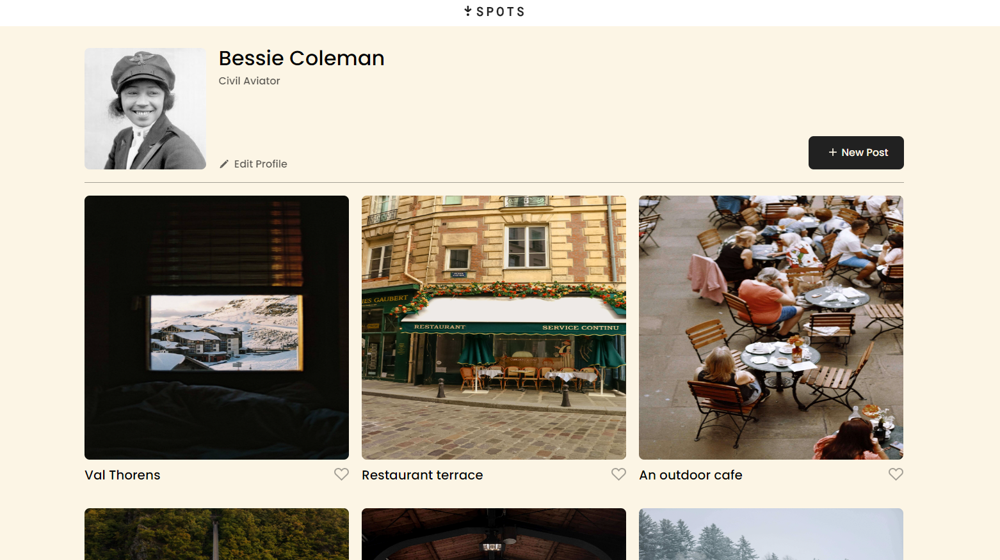
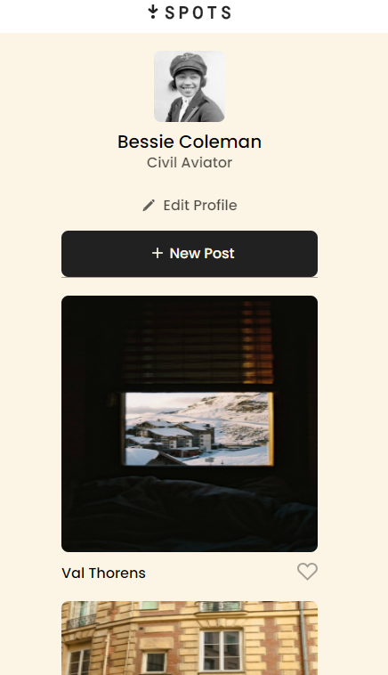
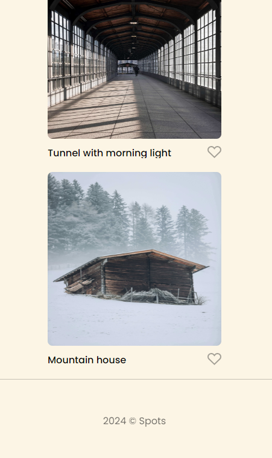

# Spots- Image Sharing

Spots is a social media web app (JavaScript functionality will be added) in which a user can share photos. It's built using HTML, CSS, Flexbox, and Grid. This project is responsive and optimized for screen 1440px and above, as well as 627 px and below.

## Project Features and Technology Used

- Semantic HTML5
- CSS
- Figma
- Flexbox
- Grid
- Responsive Design
- Media Queries

## Sneak Peak:

`1440px`

`627px`

## Deployment

This site is deployed to GitHub Pages.
Here's the link:
